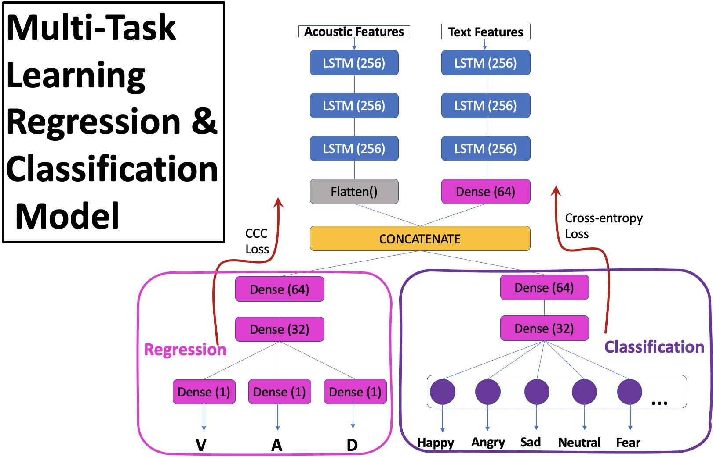
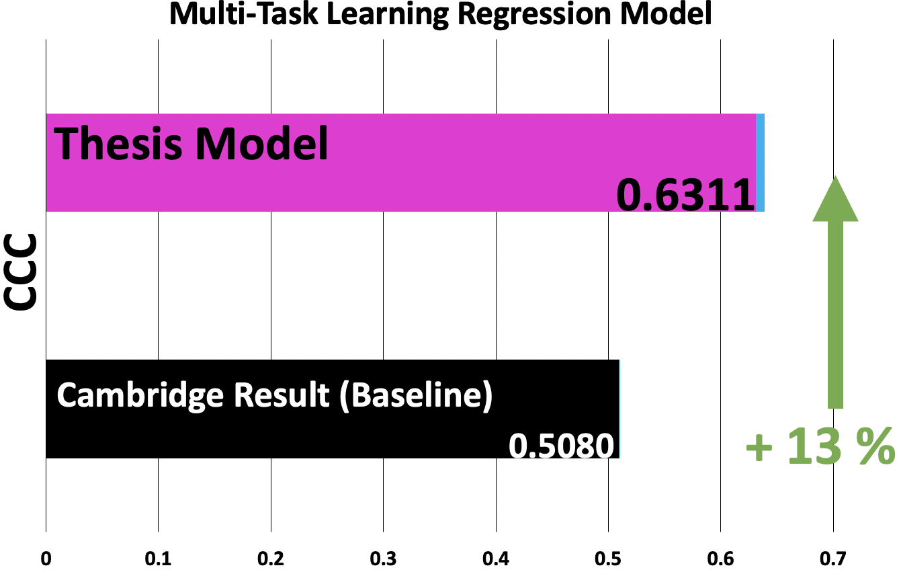
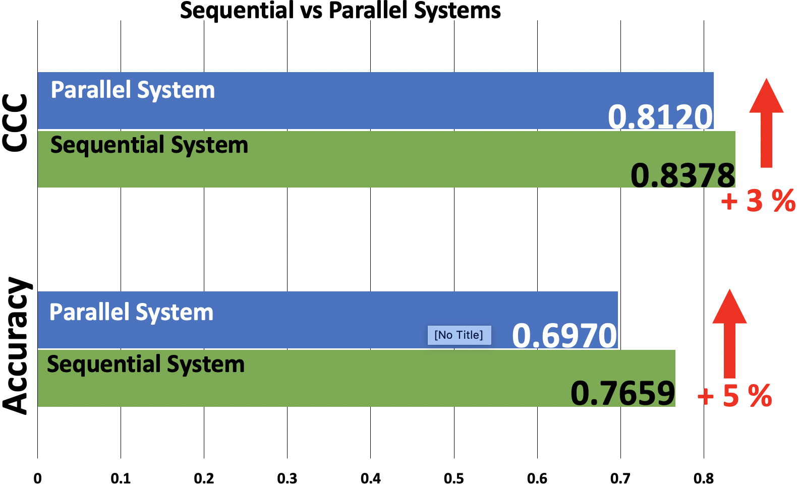

# Dimensional and Discrete Emotion Recognition using Multi-task Learning from Acoustic and Linguistic features extracted from Speech

## Requirements 
``
nltk==3.6.1   matplotlib==3.3.3 numpy==1.19.5 audiofile==0.4.1 contractions==0.0.49 opensmile==2.0.0 seaborn==0.11.1 pandas==1.1.4 SpeechRecognition==3.8.1
scipy==1.5.4  Keras==2.2.4  torch==1.5.1  imblearn==0.0 pyAudioAnalysis==0.3.7  scikit_learn==0.24.2  xgboost==1.4.2
``
## Abstract
The majority of research in speech emotion recognition focuses on the classification
of discrete emotions either from acoustic features or text features. This thesis demonstrates that the dimensional representation of emotions is also very valuable and it shows
its advantages over categorical emotions. The thesis proposes two different systems which
both use bimodal features (text and acoustics) in order to recognize discrete and dimensional emotions. A sequential system that first performs dimensional regression and then
classification and a parallel system that performs classification and regression at the same
time.

The thesis develops a multi-task regression model that serves as the core for both systems. Using the Concordance Correlation Coefficient (CCC) for evaluation it is discovered that the thesis developed architecture for dimensional regression outperforms across
all dimensions (valence, arousal, dominance) the regression model introduced in previous
research at the Cambridge institution. In addition, the thesis proves that the sequential
system outperforms the parallel system in the recognition of both discrete (classification
accuracy) and dimensional emotions (CCC). This finding verifies the validity of the theoretical model of psychology about dimensional emotions and its ability to represent a
discrete emotion in a three dimensional space without losing any information. Furthermore, it is demonstrated how transfer learning can be used in this specific task to improve
the results of the system.

## Models 
Regression             |  Regression & Classification
:-------------------------:|:-------------------------:
  |  

## Systems
 

## Results
 
 

